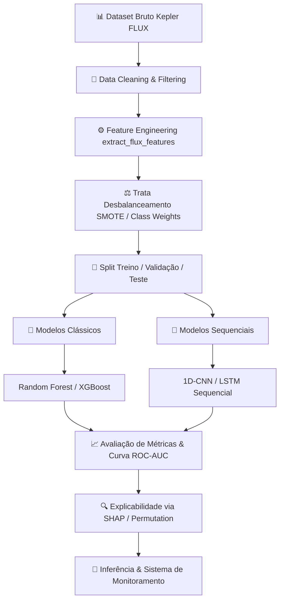
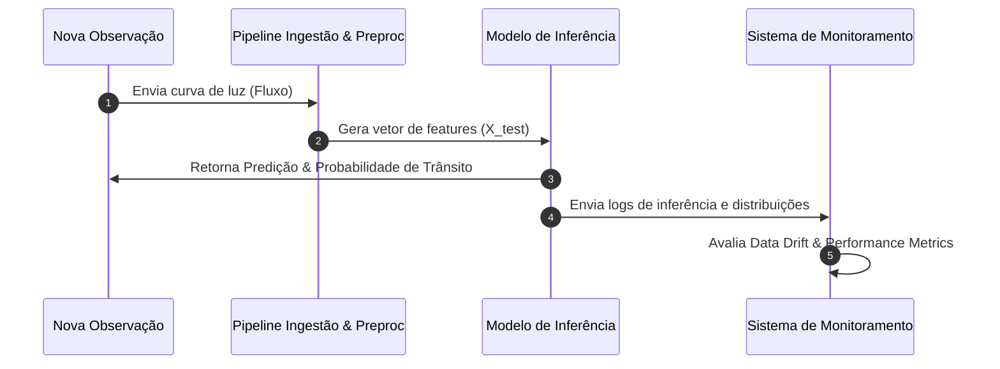

<div align="center">

# 🪐 ExoHunter-ML
### *Machine Learning Pipeline for Automated Exoplanet Candidate Detection from Astronomical Light Curves*

[](https://www.python.org/)
[](https://jupyter.org/)
[](https://scikit-learn.org/)
[](https://xgboost.readthedocs.io/)
[](https://www.tensorflow.org/)
[](https://exoplanetarchive.ipac.caltech.edu/)
[]()
[](LICENSE)

<br/>

> **Pipeline robusto e reprodutível de Engenharia de Machine Learning focado na detecção automática e classificação de candidatos a exoplanetas a partir do método de fotometria de trânsito em séries temporais astronômicas.**

</div>

---

## 📌 Sumário
- [Visão Geral](#-visão-geral)
- [Contexto Científico & Fundamentação Matemática](#-contexto-científico--fundamentação-matemática)
- [Arquitetura da Pipeline & Experimentos](#-arquitetura-da-pipeline--experimentos)
- [Engenharia de Features Fotométricas](#-engenharia-de-features-fotométricas)
- [Estratégia de Explicabilidade (XAI)](#-estratégia-de-explicabilidade-xai)
- [Arquitetura MLOps & Monitoramento em Produção](#-arquitetura-mlops--monitoramento-em-produção)
- [Estrutura do Repositório](#-estrutura-do-repositório)
- [Como Executar](#-como-executar)
- [Entregáveis Acadêmicos & Status](#-entregáveis-acadêmicos--status)
- [Considerações Éticas e Científicas](#-considerações-éticas-e-científicas)
- [Autor](#-autor)

---

## 🔭 Visão Geral

A descoberta de exoplanetas gera volumes massivos de dados fotométricos que demandam processamento automatizado e preciso. O **ExoHunter-ML** investiga a aplicação de algoritmos clássicos de Machine Learning e redes neurais profundas para identificar perturbações sutis na variação do brilho estelar em séries temporais do telescópio **NASA Kepler / K2**.

Projetado sob rigorosos princípios de **Engenharia de ML**, o projeto aborda todas as fases do ciclo de vida de um modelo:
- **Ingestão e Validação:** Tratamento de dados astronômicos em alta dimensão.
- **Tratamento de Desbalanceamento:** Manejo do desequilíbrio extremo de classes ($>99\%$ de estrelas sem trânsitos confirmados ou falsos-positivos astrofísicos).
- **Interpretabilidade:** Uso de técnicas de *XAI (Explainable AI)* para validação astronômica.
- **Operacionalização:** Desenho de arquitetura para inferência contínua, monitoramento de *Data Drift* e readequação do modelo.

---

## 📐 Contexto Científico & Fundamentação Matemática

O método de **Fotometria de Trânsito** baseia-se na medição da atenuação temporária do fluxo luminoso de uma estrela quando um corpo planetário cruza a linha de visada entre a estrela e o telescópio.

```text
       Fluxo Luminoso (F)
         ▲
   1.0 ──┤────────┐               ┌────────  (Brilho Estelar Normal)
         │        │               │
  1-ΔF ──┤        └───────────────┘          (Evento de Trânsito Exoplanetário)
         └────────┼───────────────┼────────► Tempo (t)
                  t_1             t_2

```

### 1. Profundidade do Trânsito ($\Delta F$)

A atenuação fotométrica do fluxo luminoso é diretamente proporcional à razão entre a área do disco planetário e a área do disco estelar:

$$\Delta F = \frac{F_{\text{fora}} - F_{\text{trânsito}}}{F_{\text{fora}}} = \left( \frac{R_p}{R_*} \right)^2$$

Onde $R_p$ é o raio do exoplaneta e $R_*$ é o raio da estrela hospedeira.

### 2. Extração de Métricas Estatísticas

Para isolar atenuações reais de ruídos térmicos e variações instrumentais do telescópio, extraem-se os momentos estatísticos fundamentais da curva de luz ($F_1, F_2, \dots, F_N$):

$$\mu_{\text{flux}} = \frac{1}{N} \sum_{i=1}^{N} F_i \quad \quad \sigma_{\text{flux}} = \sqrt{\frac{1}{N} \sum_{i=1}^{N} (F_i - \mu)^2}$$

$$\text{Assimetria (Skewness)} = \frac{\frac{1}{N} \sum_{i=1}^{N} (F_i - \mu)^3}{\sigma^3}$$

$$\text{Curtose (Kurtosis)} = \frac{\frac{1}{N} \sum_{i=1}^{N} (F_i - \mu)^4}{\sigma^4} - 3$$

---

## 🛠 Arquitetura da Pipeline & Experimentos

A pipeline experimental foi projetada para garantir **prevenção rigorosa de Data Leakage**, aplicando todas as transformações e engenharias de atributos exclusivamente nas partições de treino.



### Abordagens de Modelagem

| Categoria | Modelos Investigados | Função na Pipeline |
| --- | --- | --- |
| **Baseline** | Logistic Regression | Ponto de partida estatístico simples |
| **Machine Learning Clássico** | Random Forest, XGBoost, Decision Trees, SVM | Classificação baseada em *Features Extraídas* |
| **Deep Learning** | LSTM, 1D-CNN | Aprendizado de padrões temporais em séries de fluxo bruto |

---

## 🧬 Engenharia de Features Fotométricas

A função `extract_flux_features()` transforma centenas de medições do fluxo estelar bruto em atributos compactos e altamente informativos (`feature_names_in_`):

| Feature | Descrição Física / Estatística | Papel no Diagnóstico |
| --- | --- | --- |
| `flux_mean` | Fluxo médio normalizado | Estabilização da magnitude estelar base |
| `flux_std` | Desvio padrão da variabilidade | Mapeamento do ruído e atividade estelar |
| `flux_min` | Atenuação mínima observada ($F_{\text{trânsito}}$) | Detecção primária da profundidade de trânsito ($\Delta F$) |
| `flux_skew` | Assimetria da distribuição de brilho | Identificação de quedas unilaterais no brilho |
| `flux_kurtosis` | Curtose do vetor de tempo | Isolamento de artefatos instrumentais e *spikes* |

---

## 🔍 Estratégia de Explicabilidade (XAI)

Para garantir validação científica, o modelo utiliza técnicas de interpretabilidade para avaliar o peso de cada variável na predição:

```text
Atributo          Importância Relativa no Modelo
───────────────   ─────────────────────────────────────────────
flux_min          ████████████████████████████████████████ (Alto impacto em ΔF)
flux_skew         ████████████████████████ (Detecção de quedas unilaterais)
flux_std          ██████████████ (Filtro de estabilidade estelar)
flux_kurtosis     █████████ (Identificação de falsos picos)

```

> **Nota:** As importâncias de atributos são interpretadas como **associações preditivas estatísticas** e não como comprovações de causalidade astrofísica sem validação cruzada independente.

---

## 🛰️ Arquitetura MLOps & Monitoramento em Produção

O projeto foi desenhado contemplando um ciclo operacional contínuo para implantação em produção:



### Métricas de Monitoramento Contínuo

* **Data & Feature Drift:** Verificação da distribuição das medições fotométricas de entrada via teste de Kolmogorov-Smirnov.
* **Model Drift:** Acompanhamento contínuo da distribuição de confianças preditivas e taxa de falsos positivos/negativos.
* **Gatilhos de Retreinamento:** Inicializados caso o *F1-Score* caia abaixo do limiar estipulado ou ocorra uma mudança significativa nos sensores do telescópio.

---

## 📁 Estrutura do Repositório

```text
ExoHunter-ML/
│
├── 📁 data/                           # Datasets e instruções de ingestão
│   ├── raw/                           # Dados fotométricos brutos (Kepler/K2)
│   └── processed/                     # Matrizes e eixos limpos pós-feature engineering
│
├── 📁 notebooks/                       # Google Colab / Jupyter Notebooks
│   ├── ExoHunter_ML.ipynb             # Pipeline principal: EDA, ML Clássico e Inferência
│   ├── ExoHunter_ML(lab2).ipynb       # Experimentos avançados e tuning de hiperparâmetros
│   └── modelagem_matemática(ExoHML).ipynb # Formulação física e matemática do trânsito
│
├── 📁 src/                            # Código modular e reutilizável
│   ├── data/                          # Módulos de limpeza e ingestão
│   ├── features/                      # Scripts de extração estatística de fluxo
│   ├── models/                        # Classes e métodos de treino/inferência
│   └── evaluation/                    # Cálculo de métricas e curvas de performance
│
├── 📁 reports/                         # Relatórios, tabelas e figuras geradas
│   └── figures/                       # Gráficos de matriz de confusão e curvas ROC
│
├── 📄 requirements.txt                # Dependências do ambiente Python
└── 📄 README.md                       # Documentação principal

```

---

## 🚀 Como Executar

### 1. Clonar o Repositório e Configurar o Ambiente

```bash
# Clone o repositório
git clone [https://github.com/el-pitchula/ExoHunter-ML.git](https://github.com/el-pitchula/ExoHunter-ML.git)
cd ExoHunter-ML

# Crie e ative um ambiente virtual
python -m venv venv
# No Linux/macOS:
source venv/bin/activate
# No Windows:
venv\Scripts\activate

# Instale as dependências
pip install -r requirements.txt

```

### 2. Execução dos Notebooks

Inicie o servidor do Jupyter Notebook ou Abra via Google Colab:

```bash
jupyter notebook notebooks/ExoHunter_ML.ipynb

```

---

## 🎓 Entregáveis Acadêmicos & Status

Desenvolvido para a disciplina de **Engenharia de Machine Learning**, este projeto cumpre os seguintes marcos de desenvolvimento:

* [x] Definição de Arquitetura e Escopo do Projeto
* [x] Estruturação da Fundamentação Física e Matemática
* [x] Pipeline de Ingestão e Pré-processamento de Dados
* [x] Engenharia de Features Estatísticas de Fluxo Luminoso
* [x] Treinamento do Modelo Baseline (Random Forest / XGBoost)
* [ ] Implementação de Modelo Sequencial (LSTM / 1D-CNN)
* [ ] Análise e Explicabilidade com SHAP
* [ ] Relatório Técnico Acadêmico em LaTeX (`docs/projeto.tex`)

---

## ⚠️ Considerações Éticas e Científicas

O sistema desenvolvido funciona como uma **ferramenta de auxílio computacional** para triagem e filtragem de grandes volumes de dados astronômicos.

Uma predição positiva gerada pelo algoritmo de Machine Learning **não constitui confirmação científica definitiva de um exoplaneta**. A confirmação oficial requer validação astrofísica rigorosa, espectroscopia de alta resolução e análise independente por meio de telescópios complementares.

---

## 👤 Autor

**Jaysa Gabrielly**

* 🐙 GitHub: [@el-pitchula](https://github.com/el-pitchula)
* 💼 LinkedIn: [Perfil no LinkedIn](https://www.linkedin.com)

---