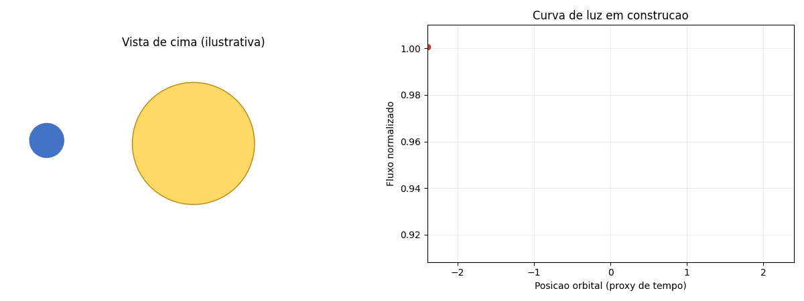
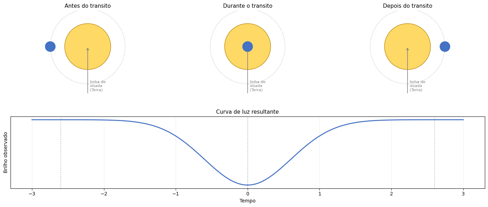
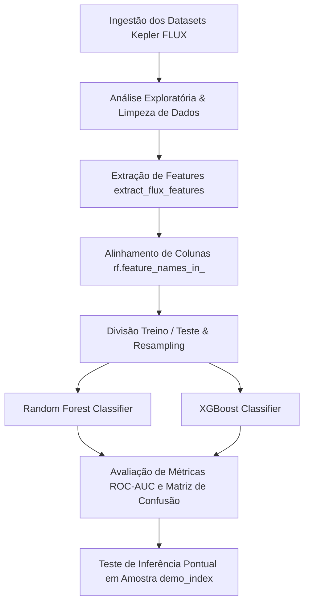

<div align="center">

# 🪐 ExoHunter-ML
### *Exoplanet Transit Detection via Machine Learning & Flux Feature Extraction*

[](https://www.python.org/)
[](https://jupyter.org/)
[](https://scikit-learn.org/)
[](https://xgboost.readthedocs.io/)
[](https://exoplanetarchive.ipac.caltech.edu/)
[](LICENSE)

<br/>

> **Pipeline de Machine Learning e modelagem matemática aplicada à Astrofísica Observacional para detecção automatizada de exoplanetas a partir do fluxo estelar do Telescópio Espacial Kepler.**

</div>

---

## Sumário
- [Visão Geral](#-visão-geral)
- [Fundamentação Física & Modelagem Matemática](#-fundamentação-física--modelagem-matemática)
- [Arquitetura da Pipeline](#-arquitetura-da-pipeline)
- [Engenharia de Features](#-engenharia-de-features)
- [Treinamento & Avaliação de Modelos](#-treinamento--avaliação-de-modelos)
- [Demonstração de Inferência](#-demonstração-de-inferência)
- [Estrutura do Repositório](#-estrutura-do-repositório)
- [Como Executar](#-como-executar)
- [Autor](#-autor)

---

## Visão Geral

O **ExoHunter-ML** aborda a classificação e identificação de candidatas a exoplanetas analisando séries temporais do **Telescópio Espacial Kepler (NASA)**. 

Devido ao severo desbalanceamento de classes em observações fotométricas reais (onde a imensa maioria dos sinais pertence a estrelas sem trânsitos planetários), os notebooks do projeto cobrem experimentalmente:
- **Análise Exploratória e Diagnóstico de Desbalanceamento:** Leitura e visualização das curvas de luz de treino e teste.
- **Modelagem Matemática Dedicada:** Formulação física da atenuação estelar e extração estatística de moments de distribuição.
- **Engenharia de Features:** Extração e seleção de atributos informativos via `extract_flux_features()`.
- **Modelagem Preditiva & Resampling:** Comparação entre modelos de Machine Learning (Random Forest, XGBoost) e estratégias de tratamento do desbalanceamento de dados.
- **Validação e Inferência em Amostras:** Demonstração da extração e predição de candidatos usando fatias de teste.

---

## Fundamentação Física & Modelagem Matemática

O projeto fundamenta-se na **Fotometria de Trânsito**, na qual o fluxo luminoso de uma estrela hospedeira sofre uma queda periódica no brilho quando um exoplaneta transita diante de seu disco estelar em relação à linha de visada do observador.

<p align="center">
  
  <br/>
  <i>Figura 1: Animação demonstrativa da posição orbital e a respectiva construção da curva de luz fotométrica em tempo real.</i>
</p>

<br/>

<p align="center">
  
  <br/>
  <i>Figura 2: Estágios fundamentais da passagem planetária (antes, durante e depois) e o formato do perfil de atenuação.</i>
</p>

### 1. Profundidade do Trânsito ($\Delta F$)

A atenuação do fluxo estelar relata diretamente a proporção das superfícies do exoplaneta ($R_p$) e da estrela ($R_*$):

$$\Delta F = \frac{F_{\text{fora}} - F_{\text{trânsito}}}{F_{\text{fora}}} = \left( \frac{R_p}{R_*} \right)^2$$

### 2. Momentos Estatísticos do Fluxo

Para isolar sinais reais de atenuação do ruído instrumental das medições ($FLUX_1, \dots, FLUX_n$), extraem-se os momentos estatísticos fundamentais da série temporal:

$$\mu_{\text{flux}} = \frac{1}{N} \sum_{i=1}^{N} F_i \quad \quad \sigma_{\text{flux}} = \sqrt{\frac{1}{N} \sum_{i=1}^{N} (F_i - \mu)^2}$$

$$\text{Assimetria (Skewness)} = \frac{\frac{1}{N} \sum_{i=1}^{N} (F_i - \mu)^3}{\sigma^3}$$

$$\text{Curtose (Kurtosis)} = \frac{\frac{1}{N} \sum_{i=1}^{N} (F_i - \mu)^4}{\sigma^4} - 3$$

---

## Arquitetura da Pipeline

O fluxo de trabalho contido nos notebooks segue as seguintes etapas lineares:



---

## Engenharia de Features

Para otimizar o desempenho do classificador, a função `extract_flux_features()` transforma os pontos brutos da série temporal de fluxo em um conjunto compacto de recursos estatísticos discriminatórios:

| Atributo / Feature | Métrica Estatística | Função no Diagnóstico |
| --- | --- | --- |
| `flux_mean` | Média | Medida de tendência central do fluxo luminoso |
| `flux_std` | Desvio Padrão | Quantificação da variabilidade e ruído estelar |
| `flux_min` | Valor Mínimo | Mapeamento direto do ponto de atenuação máxima ($\Delta F$) |
| `flux_skew` | Assimetria (*Skewness*) | Sensibilidade a desvios unilaterais causados por trânsitos |
| `flux_kurtosis` | Curtose (*Kurtosis*) | Isolamento de picos extremos e anomalias instrumentais |

### Explicabilidade dos Atributos (SHAP Analysis)

A contribuição relativa das features na tomada de decisão dos modelos é validada utilizando valores SHAP (*SHapley Additive exPlanations*):

---

## Treinamento & Avaliação de Modelos

Os notebooks comparam estratégias para maximizar a capacidade de detecção da classe minoritária (estrelas com exoplanetas confirmados):

* **Modelos Utilizados:** Random Forest Classifier e XGBoost.
* **Tratamento do Desbalanceamento:** Aplicação de reamostragem/pesos de classe para evitar overfitting na classe majoritária.
* **Métricas Focadas:** Curva ROC-AUC, Precision, Recall e análise cuidadosa da **Matriz de Confusão**, onde o objetivo principal é a minimização de **Falsos Negativos**.

---

## Demonstração de Inferência

Os notebooks trazem um pipeline prático de inferência para extrair features e predizer amostras individuais de teste selecionadas por seu índice (`demo_index`):

```python
# Exemplo de pipeline de inferência presente nos notebooks
demo_index = 0

# 1. Seleção e conversão do sinal de fluxo
flux_demo = X_test.iloc[demo_index].values.astype(float)

# 2. Extração das features estatísticas
features_demo = extract_flux_features(flux_demo)

# 3. Alinhamento com as colunas do modelo treinado
features_demo = features_demo[rf.feature_names_in_].copy()

# 4. Exibição e inferência com o modelo
display(features_demo)
pred = rf.predict(features_demo)

```

### Análise de Candidatos & Probabilidades

A validação gráfica dos candidatos compara a profundidade de queda observada (`max_drop`) com a probabilidade prevista pelo modelo, permitindo a definição de um limiar (*threshold*) otimizado de decisão:

---

## Estrutura do Repositório

```text
ExoHunter-ML/
│
├── 📁 assets/                         # Imagens e gifs utilizados na documentação
│   ├── 0001.png
│   ├── 0002.gif
│   ├── 0003.png
│   ├── 0004.png
│   └── 0005.png
│
├── 📄 ExoHunter_ML.ipynb              # Pipeline principal: EDA, extração de features e modelos
├── 📄 ExoHunter_ML(lab2).ipynb        # Experimentos secundários, tuning e validações adicionais
├── 📄 modelagem_matemática(ExoHML).ipynb # Dedução e formulação da física da fotometria
├── 📄 requirements.txt                # Dependências do projeto (Pandas, Scikit-Learn, Matplotlib, etc.)
└── 📄 README.md                       # Documentação do repositório

```

---

## Como Executar

1. **Clone o repositório:**

```bash
git clone [https://github.com/el-pitchula/ExoHunter-ML.git](https://github.com/el-pitchula/ExoHunter-ML.git)
cd ExoHunter-ML

```

2. **Crie e ative um ambiente virtual:**

```bash
python -m venv venv
# Linux/macOS
source venv/bin/activate
# Windows
venv\Scripts\activate

```

3. **Instale as dependências:**

```bash
pip install -r requirements.txt

```

4. **Execute os notebooks:**

```bash
jupyter notebook ExoHunter_ML.ipynb

```
